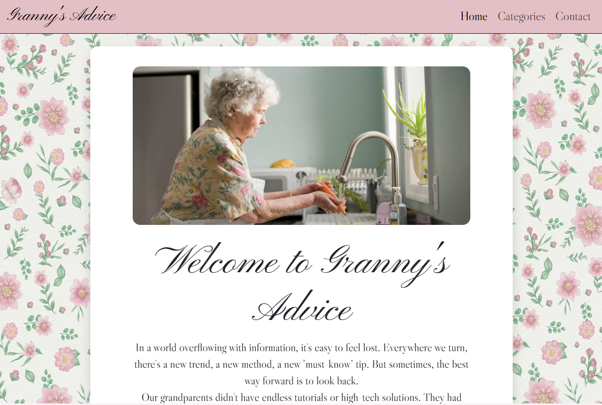
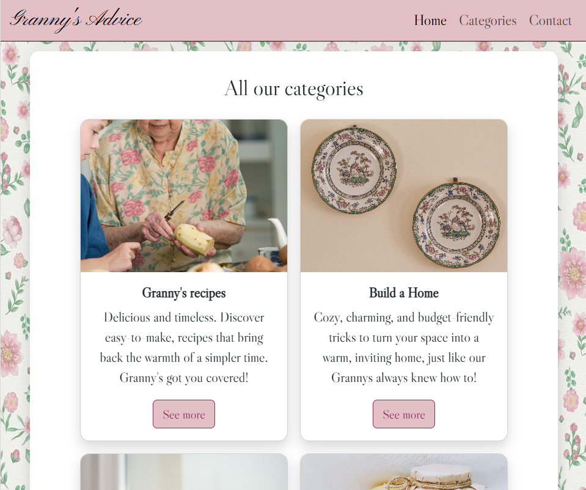
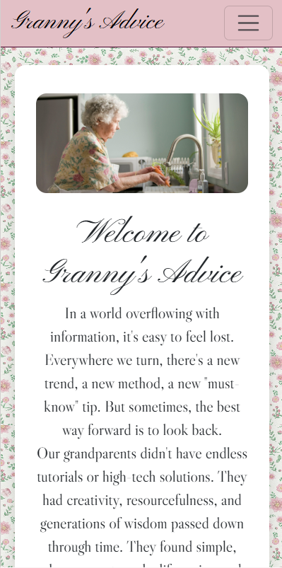
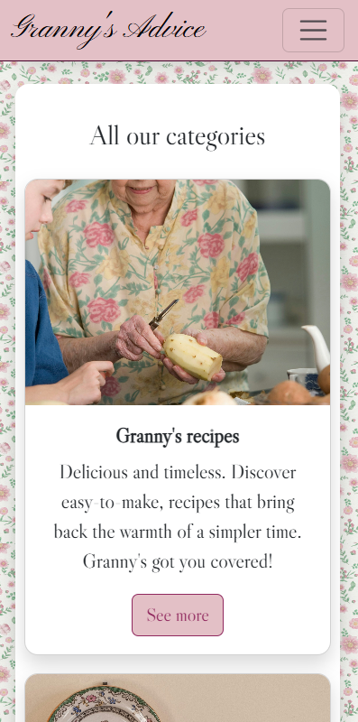
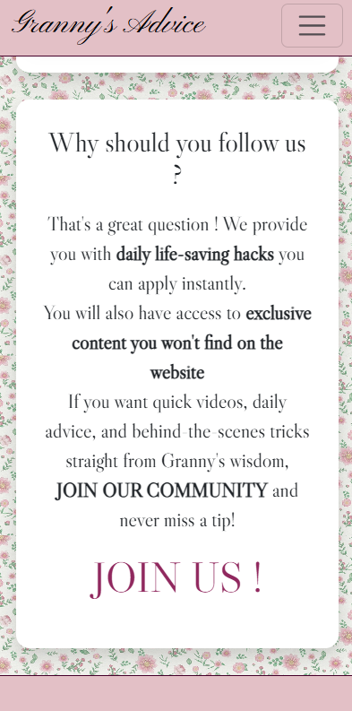
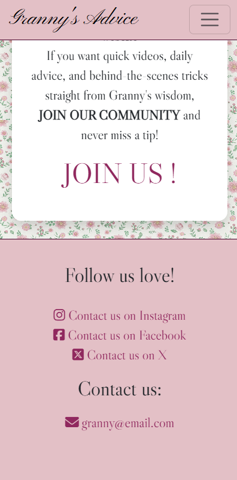
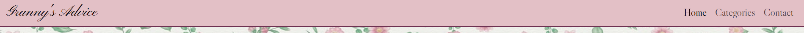
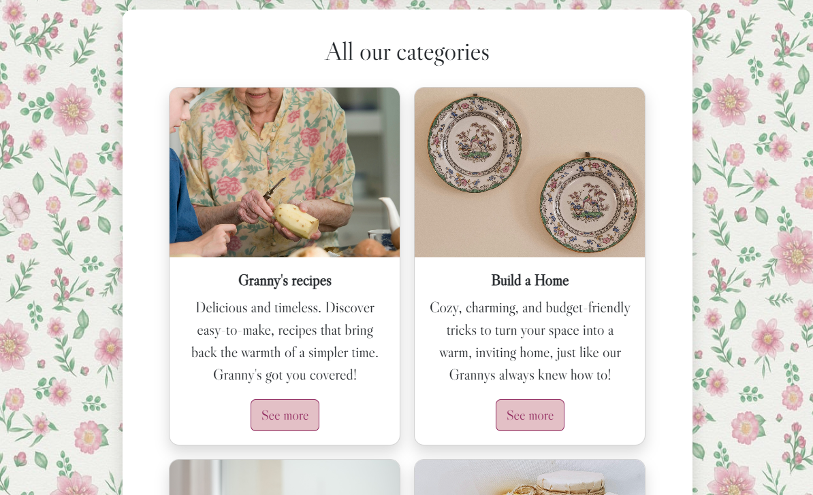
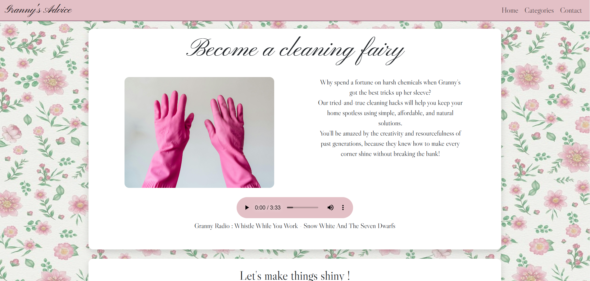
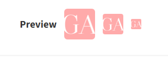

# Granny's Advice

## Description
Granny's Advice is a website that provides timeless, heartfelt advice from Granny. Over time, the collection of advice will grow, covering a variety of practical and budget-friendly tips for everyday life.

The design of the website blends modern, user-friendly navigation with nostalgic, cozy aesthetics that evoke the feeling of visiting a grandmother's home.

## Laptop

## Tablet

## Small Device

## Business Goal
The primary business goal of Granny's Advice is to increase social media traffic. By encouraging users to engage with the website’s content and follow us on social media thanks to call to actions. The website will strategically use keywords to make it easier for people to find the content they need, whether searching for life tips or simply enjoying a nostalgic escape. In the future, we plan to implement monetization strategies such as advertisements or prenium content.

## Target audiance
The target audience for Granny's Advice primarily consists of young adults between the ages of 18-35. These individuals are likely transitioning to independent living and may be looking for affordable, practical tips on managing daily life, chores, and budgeting. Additionally, the nostalgic aesthetic appeals to younger generations who are drawn to vintage or comforting content, while older generations will recognize and appreciate the familiar feel of "grandmother's advice."

## Why they are the target:
- Budget-Conscious: Many young adults are navigating their first experiences with managing finances and household tasks. They seek affordable, practical advice to make everyday life easier.
- Nostalgia: Younger generations enjoy nostalgic content, especially related to family, comfort, and simpler times. This trend is popular on social media and resonates with this demographic.
- Familiar Aesthetic: The vintage, grandmotherly design appeals to users who seek a sense of comfort and emotional connection, drawing them in with warm, timeless visuals.

## User intervew
The design logic of this website was based on the most popular responses from our user interview. These insights guided us in choosing the preferred layout, emotional triggers, and visual elements (such as colors and patterns) that evoke memories of their grandmothers. Additionally, it helped us determine the content that would be most useful and appealing, attracting visitors to our site.

## Features
1. Navigation: A simple and intuitive navigation menu to help the user navigate the website.

2. Welcome Section: A section with an introductory message offering a warm welcome and setting the tone for the advice that follows.

3. Category Section: Various advice categories such as Health, Recipes, Cleaning, and Building a Home. Each category links to a separate page with more detailed tips.

4. Follow Us Section: Explains the benefits of following Granny on social media.

5. Contact Us Footer: Provides contact details and social media links for users to get in touch with Granny, ask questions, or seek advice.

## All the pages
- The Home page seen above.
- recipes.html

- build-a-home.html

- cleaning.html

- remedies.html

## Futur features 
1. Newsletter Subscription: A "Join my newsletter" option for users to receive extra content.
2. New Categories: Based on feedback from user interviews, we plan to expand the categories to cover more topics that align with the needs of the audience.
3. Search Filter: As the catalog of advice grows, a search filter will be added to make navigation smoother and help users find specific content more easily.
4. Monetization: Future plans include introducing ads on the website to generate revenue, which will help sustain and grow the project.
5. Prenium content: For exclusive advice, tips, and special features available to subscribers. 
6. Forum: To encourage engagement and create a community where users can share their own experiences, ask questions, and interact with each other and Granny.

## Technology used
- HTML 5
- CSS 3
- Bootstrap
- JavaScript

## How to View the Project
- [View the deployed website] https://saraelizalde.github.io/Granny-s-Advice/

## Development Process
- I started with Balsamiq to create a wireframe, aiming for a website that feels like a 2000s blog or an old book to trigger nostalgia.

- Initially, I used a background image, knowing it might change based on user interviews. Placing the background was challenging, and after multiple attempts until the end of the project, I settled on: 
background-size: contain;
background-repeat: round;
background-attachment: fixed;
But here was the first vision:

- I added a Bootstrap navbar, but struggled with responsiveness, it became too thin on smaller screens. Fixed this by modifying a Bootstrap class. And I made it collapse on medium screens and pushed nav-items to the right.

- Centered the header image to resemble an old-fashioned book.
Added media queries to make the background more visible on large screens and gaps between sections for a balanced look.

- Based on user interviews feedback, I updated:
Background: Changed to a floral pattern.
Color Palette: Switched to green and pinks.
Content Focus: Aligned with the most popular responses.

- Worked on cards for the main section, ensuring they fit visually with the header.
Struggled with responsiveness but created a section class and set:
 max-width: 90%; And this solved the problem.

- Initially wanted a fixed footer to keep social media links always visible (important for the business plan).
It was too thick, so I opted for a fixed navbar instead for easier navigation on small devices as there is a lot of scrolling.

- Created recipe.html with a slightly different header layout to keep consistency while making it unique.
Added a back button to return to categories but struggled to style it without affecting all links.
Fixed it by specifically targeting : .card .card-body a { }

- After adding content, buttons were misaligned due to varying text sizes.

 Fixed by adding Bootstrap classes: d-flex, flex-column and mt-auto. However, this made the buttons too wide. To fix this: width: auto;
align-self: center;

- Realized that recipe cards would be too long on small screens, so I attempted to use Bootstrap collapsible components.
The collapse function worked but expanded all cards at once instead of individually.
Tried multiple JavaScript and Bootstrap classes solutions but couldn't get an accordion effect. Decided to leave it as is and revisit when I improve my JavaScript skills.

- Created cards without buttons for other pages. Researched content using ChatGPT & the internet. Struggled to find aesthetic images that fit the page’s vibe without being heavy to load on the screen, which ended up being the biggest performance problem.

- Added shadows to cards and sections for a better visual effect.
Initially struggled but ended up using Bootstrap.

- Clicking the navbar internal link to the category section caused the fixed navbar to hide the section title.
Tried margin and padding fixes, but they affected the page layout.
Tried scroll-margin-top but couldn’t override some Bootstrap’s styles somewhere.
So I endend up asking ChatGPT for JavaScript help, and the script worked only on the homepage but not when navigating from another page.
Will revisit once I have more JavaScript experience.

- Found an awkward two-to-one-to-two card layout at 829px width.
Adjusted media queries to widen sections at that breakpoint.

- The site looked too visually busy, so I:
Changed green backgrounds to white for a cleaner look.
Refined images and text alignment.
Added borders to the navbar and footer for better separation.
Added a favicon for branding.  

    Updated card design by removing margins around images for a more modern look but keeping rounded corners for a 60s aesthetic across the website.

## Credits
- The JavaScript code for ensuring the Bootstrap mobile navbar collapses when navigating to in-page links comes from Code Institute.
- The JavaScript code for enabling smooth scrolling in index.html was generated with the help of ChatGPT.
- The navbar, the links, the buttons and the cards came from Bootstrap before being updated via CSS.
- Chat GPT helped finding the advices and formulating most of the texts. 